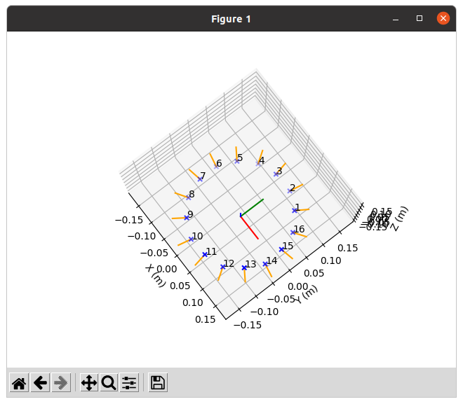

# Odas Configuration Generator
This is a tool to generate the microphone configuration for [ODAS](https://github.com/introlab/odas).



## Setup
1. Setup the Python virtual environment.
```bash
sudo apt install python3.8-venv
cd ~/t-top_ws/src/t-top/tools/odas_configuration_generator
python3 -m venv ~/.env/odas-venv
source ~/.env/odas-venv/bin/activate
pip install -r requirements.txt -i https://pypi.tuna.tsinghua.edu.cn/simple
```

2. Run the generator.
```bash
python odas_microphone_configuration.py
```
